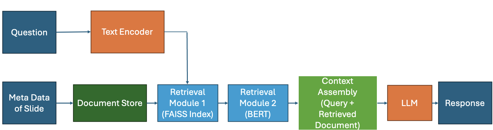

# Vision Language Retrieval Augmented Generation


## Overview
The **Vision Language Retrieval Augmented Generation** system is an AI-based educational platform that integrates **Visual Question Answering (VQA)** with advanced language models to provide interactive learning experiences. By combining visual and textual data, the platform offers an immersive way for students to engage with complex scientific content, enhancing understanding and retention.

The platform's impact on student engagement and comprehension has been evaluated in initial deployments, showcasing its potential to transform how educational content is taught and learned, particularly within graduate programs.

## Figure 1. Process Flow Architecture Diagram
 <!-- Replace with actual diagram image -->

### Detailed Explanation of the Architecture Diagram

The architecture of the **Vision Language Retrieval Augmented Generation** system is designed to process and respond to queries by integrating both **visual** and **textual** data. Below is a detailed breakdown of the system’s process flow:

1. **Inputs**:
    - **Image**: Visual data input (such as images or diagrams).
    - **Question**: Textual data input in the form of a user query or question.
    - **Meta Data (Week of Recording)**: Additional contextual data such as the week of recording, providing more context to the input data.

2. **Encoders**:
    - **Visual Encoder**: This component processes the image data to extract visual features that represent the image's contents.
    - **Text Encoder**: This component processes the textual input (the question) to extract relevant features and context.

3. **Multi-Modal Fusion**:
    - The visual and textual features are combined in the **Multi-Modal Fusion** module. A weighted combination method is used to fuse the extracted features from both the visual and textual encoders. This step creates a unified representation that merges both data types, allowing the model to understand both the visual and textual aspects of the query.

4. **Context Assembly**:
    - The fused features from the **Multi-Modal Fusion** are passed into the **Context Assembly** module. This module integrates the combined features with a retrieved document from the **Document Store**. The retrieved document, which is relevant to the query, is obtained by the **Retrieval Module**.

5. **Retrieval Module**:
    - The **Retrieval Module** utilizes **FAISS** (Facebook AI Similarity Search) to search the **Document Store** for documents related to the user’s query and metadata (e.g., week of recording). FAISS helps in efficiently searching for relevant documents based on the input data.

6. **Text Encoder (Response Generation)**:
    - The **Context Assembly** module outputs a comprehensive context, which is then processed by another **Text Encoder**. This encoder uses the assembled context to generate a response to the initial query.

7. **Output**:
    - The final output is the **Response** to the user’s query, generated based on the processed visual and textual data, as well as the relevant document retrieved from the **Document Store**.

This architecture allows for an interactive and responsive system that seamlessly integrates visual and textual information to answer user queries in an educational setting.

---

## Key Features

- **Visual and Textual Integration**: Merges visual data (images, diagrams) with text-based responses to provide a holistic understanding of complex topics.
- **Interactive Question Answering**: Allows users to ask questions related to visual content, improving engagement and retention by facilitating dynamic interaction.
- **Advanced Language Models**: Implements models like **BART-Large CNN** for accuracy, and explores **LLAMA** and **T5** for enhanced clarity and alignment with educational goals.

---

## Benefits in Educational Settings

- **Enhanced Student Engagement**: Encourages active participation by enabling students to interact directly with visual content.
- **Improved Comprehension and Retention**: The combination of visual and textual information promotes deeper understanding and better retention of material.
- **Scalability Across Subjects**: Supports expansion into various educational fields such as science, history, and technical domains.

---

## Current Challenges

- **Model Selection for Clarity and Alignment**: Achieving precise and well-aligned responses with models like **LLAMA** and **T5** remains a challenge for accurate educational content generation.
- **Infrastructure Demands**: The platform requires significant computing resources and accessibility features, which may limit its adoption in some educational settings.

---

## Future Directions

- **Enhanced User Accessibility**: Plans to optimize the platform's infrastructure, ensuring broad accessibility across different educational environments.
- **Expansion to Real-World Applications**: Exploring immersive, hands-on learning experiences that bridge the gap between academic learning and real-world scenarios.
- **Adaptive Learning Capabilities**: Future updates will aim to make the platform adaptive, offering personalized learning experiences based on students' individual needs.

---

## Installation

To get started with the **Vision Language RAG** platform, follow these steps:

### 1. Clone the Repository

```bash
git clone https://github.com/anonymous-user-2711/Info-flow-explanition.git
cd vision-language-rag
